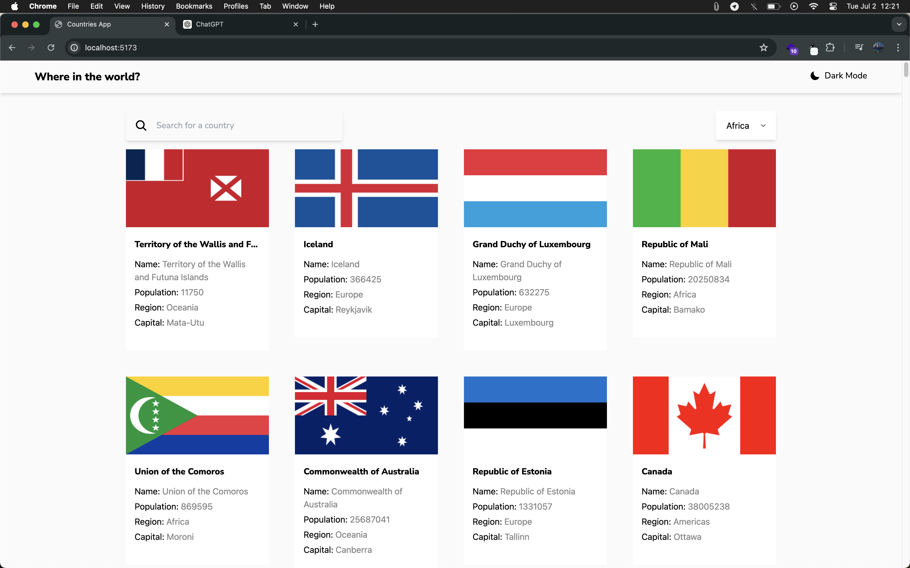
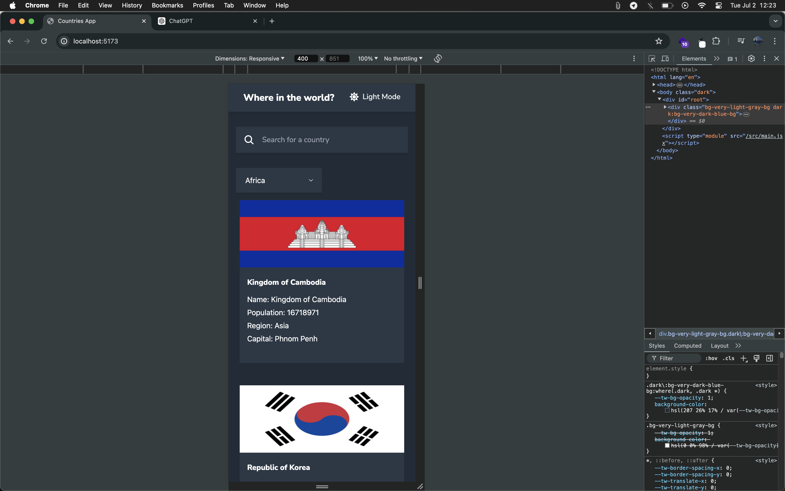

# Frontend Mentor - REST Countries API with color theme switcher solution.

## Table of contents

- [Overview](#overview)
  - [The challenge](#the-challenge)
  - [Screenshot](#screenshot)
  - [Links](#links)
- [My process](#my-process)
  - [Built with](#built-with)

## Overview.

### The challenge

Users should be able to:

- See all countries from the API on the homepage
- Search for a country using an `input` field
- Filter countries by region
- Click on a country to see more detailed information on a separate page
- Click through to the border countries on the detail page
- Toggle the color scheme between light and dark mode _(optional)_

### Screenshot

### Links

- [Solution URL](https://github.com/sadiquex/countries-app-FM)
- [Live Site URL](https://countries-app-fm-two.vercel.app/)

## My process

### Built with

- [React](https://reactjs.org/) - JS library
- Tailwind CSS
- CSS custom properties
- Flexbox
- CSS Grid
- Mobile-first workflow
